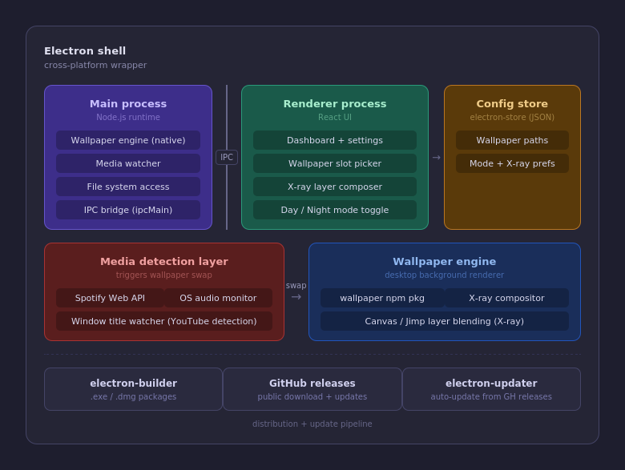

# PrismWall — Architecture & Flowchart

## System architecture

┌─────────────────────────────────────────────────────────────────────┐
│  ELECTRON SHELL  (cross-platform wrapper)                           │
│                                                                     │
│  ┌───────────────────┐  IPC  ┌─────────────────────┐  ┌──────────┐ │
│  │   MAIN PROCESS    │◄─────►│  RENDERER PROCESS   │─►│  CONFIG  │ │
│  │   Node.js runtime │       │  React UI           │  │  STORE   │ │
│  │                   │       │                     │  │          │ │
│  │ wallpaperManager  │       │ Dashboard/Settings  │  │ electron │ │
│  │ trayManager       │       │ Wallpaper slots     │  │ -store   │ │
│  │ mediaWatcher      │       │ X-ray composer      │  │ (JSON)   │ │
│  │ store             │       │ Day/Night toggle    │  │          │ │
│  └────────┬──────────┘       └─────────────────────┘  └──────────┘ │
│           │                                                         │
│    ┌──────▼──────────────┐      ┌──────────────────────────────┐   │
│    │  MEDIA DETECTION    │─────►│     WALLPAPER ENGINE         │   │
│    │                     │ swap │                              │   │
│    │  Spotify Web API    │      │  wallpaper npm package       │   │
│    │  OS audio monitor   │      │  X-ray compositor (sharp)    │   │
│    │  Window title watch │      │  Canvas / layer blending     │   │
│    └─────────────────────┘      └──────────────────────────────┘   │
│                                                                     │
│  ┌─────────────────┐  ┌──────────────────┐  ┌───────────────────┐  │
│  │ electron-builder│  │  GitHub Releases │  │ electron-updater  │  │
│  │ .exe / .dmg     │  │  public download │  │ auto-update       │  │
│  └─────────────────┘  └──────────────────┘  └───────────────────┘  │
│                    distribution + update pipeline                   │
└─────────────────────────────────────────────────────────────────────┘

---

## Wallpaper decision flowchart

App launches / mode changes / media state changes
                │
                ▼
      ┌─────────────────┐
      │  Read mode from │
      │   electron-store│
      └────────┬────────┘
               │
       ┌───────▼────────┐
       │  mode = 'day'? │
       └───┬────────┬───┘
          YES       NO (night)
           │         │
           ▼         ▼
   ┌──────────┐  ┌──────────┐
   │ isMedia  │  │ isMedia  │
   │ Playing? │  │ Playing? │
   └──┬───┬───┘  └──┬───┬───┘
     YES  NO       YES  NO
      │    │        │    │
      ▼    ▼        ▼    ▼
  dayMedia │   nightMedia │
   set?    │    set?      │
    │      │      │       │
   YES  dayDefault  YES  nightDefault
    │      │        │       │
    ▼      ▼        ▼       ▼
 show   show     show    show
dayMedia dayDefault nightMedia nightDefault
      │      │        │       │
      └──────┴────────┴───────┘
                  │
                  ▼
         wallpaper.set(path)
                  │
                  ▼
         OS desktop updated

---

## IPC communication flow

User clicks "Set wallpaper" in React UI
           │
           ▼
  window.prismAPI.pickFile()       ← defined in preload.js
           │
           ▼
  ipcRenderer.invoke('pick-file')  ← sent to main process
           │
           ▼
  ipcMain.handle('pick-file')      ← received in main.js
           │
           ▼
  dialog.showOpenDialog()          ← native OS file picker
           │
           ▼
  returns filePath to renderer
           │
           ▼
  window.prismAPI.setSlot(slot, filePath)
           │
           ▼
  ipcMain.handle('set-slot')
           │
           ├── store.set('wallpapers.dayDefault', path)
           │
           └── wallpaperManager.applyWallpaper()
                       │
                       ▼
                wallpaper.set(path)   ← OS call

---

## Tray menu flow

User right-clicks tray icon
           │
           ▼
  Menu.buildFromTemplate() renders:
  ┌──────────────────────────────┐
  │ ◈ PrismWall                  │
  │   Day mode active            │
  ├──────────────────────────────┤
  │ ☀ Day mode    ✓  Ctrl+Shift+W│  ← checkmark on active mode
  │ ☾ Night mode     Ctrl+Shift+W│
  ├──────────────────────────────┤
  │ ▣ X-ray layer   [toggle]     │
  ├──────────────────────────────┤
  │ ⊞ Open PrismWall             │
  │ ⚙ Settings       Ctrl+,      │
  ├──────────────────────────────┤
  │ ⏻ Quit PrismWall             │  ← restores default wallpaper
  └──────────────────────────────┘
           │
           ▼ on mode toggle:
  store.set('mode', newMode)
  wallpaperManager.applyWallpaper()
  tray.setContextMenu(updatedMenu)   ← re-build menu to move checkmark
  mainWindow.webContents.send('mode-changed', newMode)  ← sync React UI

---

## Media detection flow

App start
   │
   ▼
mediaWatcher.init()
   │
   ├── Spotify connected?
   │       │
   │      YES → poll /me/player every 5s
   │       │         │
   │       │    is_playing changed?
   │       │         │
   │       │        YES → global.mediaPlaying = true/false
   │       │               wallpaperManager.applyWallpaper()
   │       │               mainWindow.send('media-changed', state)
   │       │
   │      NO → show "Connect Spotify" in settings
   │
   └── (v1.5) Window title watcher
               │
               ▼
         poll active window title every 3s
               │
         contains "▶" + "YouTube"?
               │
              YES → treat as media playing
               │
               ▼
         same applyWallpaper() call as above

---

## X-ray compositor flow (v1.5)

User enables X-ray toggle
         │
         ▼
  Pick top layer image (foreground)
  Pick bottom layer image (background)
  Set opacity slider (0.0 → 1.0)
         │
         ▼
  ipcMain: sharp(bottomLayer)
             .composite([{
               input: topLayer,
               blend: 'over'
             }])
             .toFile(tempPath)
         │
         ▼
  wallpaper.set(tempPath)
  (tempPath lives in app.getPath('temp')
   → auto-cleaned on OS restart)

---

## Build + distribution flow

Dev:
  npm run start
  → electron-forge starts Vite dev server + Electron
  → hot reload on renderer changes

Production build:
  git tag v1.0.0
  git push --tags
         │
         ▼
  GitHub Actions workflow triggers
         │
         ├── builds on windows-latest → prismwall-setup.exe (NSIS)
         └── builds on macos-latest   → prismwall.dmg
                   │
                   ▼
         Attaches both to GitHub Release v1.0.0
                   │
                   ▼
         electron-updater checks this release URL on next app launch
         → notifies user in tray if update available

---

## Key constraints & decisions

| Decision | Reason |
| --- | --- |
| `nodeIntegration: false` | Security — renderer is a browser, not Node |
| `contextIsolation: true` | Required for contextBridge to work |
| `contextBridge` over direct ipcRenderer | Prevents renderer from accessing full Node API |
| `wallpaper` npm pkg over native calls | Handles Windows + macOS differences internally |
| `sharp` over `jimp` for X-ray | Non-blocking, much faster on large images |
| Poll Spotify every 5s (not WebSocket) | Spotify Web API doesn't offer push events for playback |
| Write X-ray output to `temp` dir | OS cleans it up — no leftover files in user's system |
| Single-instance lock in main.js | Prevents two copies of PrismWall fighting over wallpaper |
| Re-build tray menu on mode change | Electron's native menu doesn't support dynamic checkmarks — you must rebuild |
